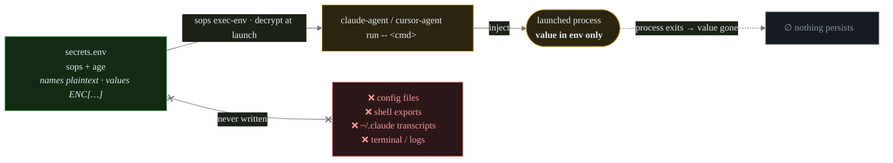
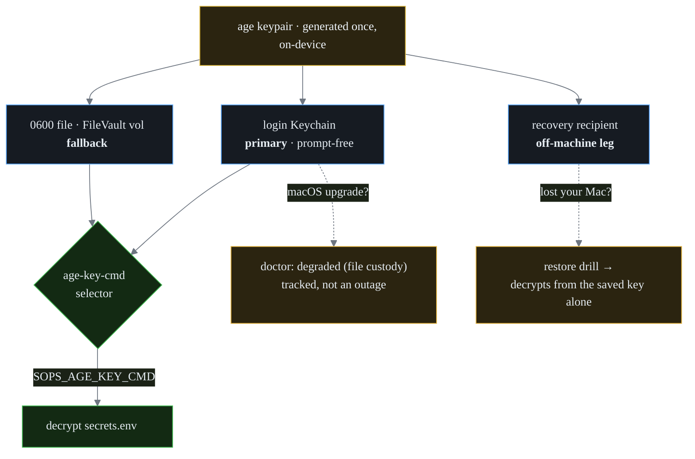
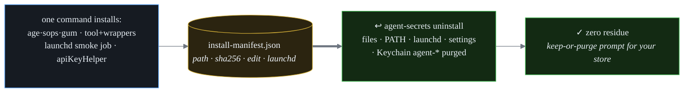

<div align="center">


<br><br>

[](https://github.com/renchris/agent-secrets/actions/workflows/ci.yml)
[](LICENSE)
[](VERSION)
[](tests)
[](SECURITY.md)
[](https://github.com/getsops/sops)
[](AGENTS.md)
[](#the-honest-ceiling)

**Encrypted at rest · injected just-in-time · never in a config, log, or transcript.**

[Why](#why-this-exists) · [Install](#the-one-command) · [How it works](#how-it-works) · [Commands](#commands) · [Security](#the-honest-ceiling) · [Uninstall](#uninstall)

</div>

<div align="center">


</div>

> **Everything stays on your machine.** The store, the keys, and every command run locally.
> The tool is built so a secret **value** is never displayed, logged, or written in plaintext
> outside the encrypted store — `list` and `doctor` only ever show you *names*.

---

## Why this exists

Coding agents (Claude Code, Cursor) need application programming interface (API) keys and tokens, and the easy path — `.env` files,
exported shell variables — scatters those secrets in plaintext across your disk and into logs and
agent transcripts.

| The problem today | The cost |
|---|---|
| `.env` files in every repo | Plaintext secrets sprawled across your disk |
| `export ANTHROPIC_API_KEY=…` in your shell | Every child process, forever, can read it |
| An agent echoes a value into its output | It lands in `~/.claude/**/*.jsonl` in plaintext |

**agent-secrets keeps the handful of secrets that must exist as raw tokens in one encrypted file,
hands them to a tool only for the moment it runs, and leaves nothing behind.** Most services
(GitHub, cloud CLIs) don't need a stored token at all — they use their own login, and this tool
leans on that first.

## The one command

```sh
sh -c "$(curl -fsLS https://raw.githubusercontent.com/renchris/agent-secrets/v0.1.0/install.sh)"
```

<table>
<tr>
<td width="50%" valign="top">

**Fully reversible** — the uninstall is one line:

```sh
agent-secrets uninstall
```

Every change is recorded to an install-manifest and rolled back completely; it *asks* before
touching your store.

</td>
<td width="50%" valign="top">

**Prefer to read it first?** A co-equal path:

```sh
curl -fsLSO …/v0.1.0/install.sh
less install.sh     # read every line
sh install.sh
```

The installer is function-guarded and pins a SHA-256–verified release.

</td>
</tr>
</table>

**Exactly what it changes on your Mac:** installs `age` + `sops` (Homebrew), the `agent-secrets`
command, an encrypted store at `~/.config/secrets/`, a key in your login Keychain, and one `PATH`
line — all removable in one command.

> **Private beta:** while this repo is private the `curl` URL 404s. Install from a mirror or a local
> checkout with `AGENT_SECRETS_BASE_URL=<mirror> sh install.sh` (see [FAQ](docs/FAQ.md)).

## How it works

### 1 · Names-only, just-in-time injection

The store is encrypted at rest. A secret is decrypted **only at the moment a tool launches**,
injected into that one process's environment, and gone when it exits. It never touches a config
file, a shell export, a log, or an agent transcript.



### 2 · One key, custodied three ways

A single `age` key unlocks the store. It lives in your login Keychain (prompt-free), with a `0600`
file fallback so a macOS upgrade can't lock you out, and a **recovery recipient** kept off-machine
so you can restore after losing the Mac entirely.



### 3 · One command in, one command out

Every install action is recorded so uninstall is total — no orphaned launchd jobs, PATH lines, or
Keychain items.



## Commands

| Command | What it does |
|---|---|
| `agent-secrets setup` | one-time onboarding wizard (idempotent — safe to re-run) |
| `agent-secrets add <NAME>` | add or update one secret (value typed hidden, never shown) |
| `agent-secrets list` | list secret **names** + rotation dates — never values |
| `agent-secrets run -- <cmd>` | run a command with secrets injected just for that process |
| `agent-secrets doctor` | health check — `--gates`, `--format=json`, `--redact`, `--fix` |
| `agent-secrets uninstall` | remove everything it installed (prompts about your secrets) |

Wrappers `claude-agent` and `cursor-agent` launch those tools with the store injected.
(`rotate` and `demo` are reserved for v0.2.)

## The honest ceiling

The store encrypts to a single `age` key. **This is all-or-nothing:** anything that runs as you and
reads the key can read the whole store — the same ceiling a password-manager vault has. What this
design adds is *keeping secrets out of the places they usually leak* and *bounding + detecting*
misuse: an in-store **canary** trips an alert on any whole-store sweep, and a process-scoped **egress
allowlist** bounds where a compromised agent can send data. It does **not** claim a per-secret audit
trail on the free tier. Full threat model → **[SECURITY.md](SECURITY.md)**


## For AI agents

Driving this tool autonomously? Start with **[AGENTS.md](AGENTS.md)** — golden rules, discovery,
copy-paste recipes, and exit codes. The command-line interface (CLI) is fully self-describing with no human needed:

```sh
agent-secrets help --json          # authoritative machine-readable command manifest
agent-secrets <command> --help     # detailed per-command help (side-effect-free, even `uninstall --help`)
```

## More

- **[AGENTS.md](AGENTS.md)** · **[llms.txt](llms.txt)** — agent-facing usage guide + large language model (LLM) link index
- **[SECURITY.md](SECURITY.md)** — threat model, the honest ceiling, reporting a vulnerability
- **[docs/FAQ.md](docs/FAQ.md)** — "I don't code", store backup, the Dock-Cursor rule, corporate installs, Touch ID

- Regenerate the demo: `scripts/record-demo.sh` (Charm [VHS](https://github.com/charmbracelet/vhs))

## Uninstall

`agent-secrets uninstall` reverses every recorded change — files, wrappers, the `PATH` line, the
launchd job, the `settings.json` edit, and the Keychain items — then **asks** whether to keep or
delete your encrypted store and keys. Add `--dry-run` to preview the plan without changing anything.

## License

[MIT](LICENSE) · © 2026 Chris Ren
