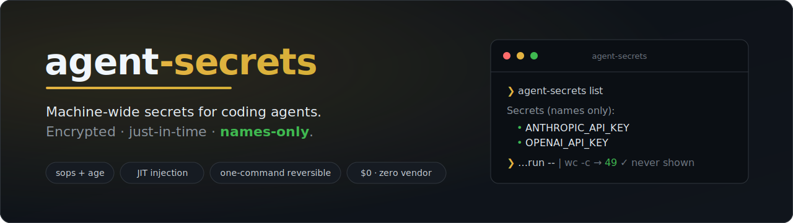
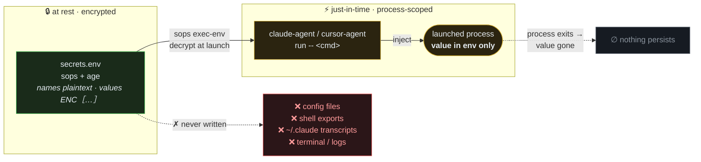
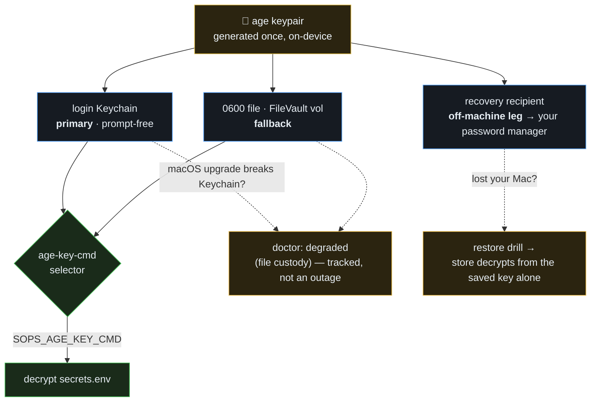
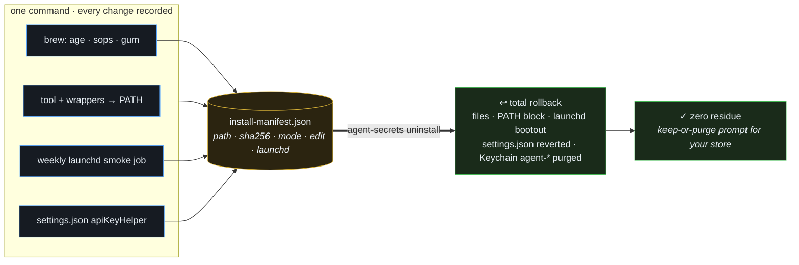

<div align="center">



<br><br>

[](https://github.com/renchris/agent-secrets/actions/workflows/ci.yml)
[](LICENSE)
[](VERSION)
[](tests)
[](SECURITY.md)
[](https://github.com/getsops/sops)
[](AGENTS.md)
[](#the-honest-ceiling)

**Encrypted at rest · injected just-in-time · never in a config, log, or transcript.**

[Why](#why-this-exists) · [Install](#the-one-command) · [How it works](#how-it-works) · [Commands](#commands) · [Security](#the-honest-ceiling) · [Uninstall](#uninstall)

</div>

<div align="center">


</div>

> **Everything stays on your machine.** The store, the keys, and every command run locally.
> The tool is built so a secret **value** is never displayed, logged, or written in plaintext
> outside the encrypted store — `list` and `doctor` only ever show you *names*.

---

## Why this exists

Coding agents (Claude Code, Cursor) need application programming interface (API) keys and tokens, and the easy path — `.env` files,
exported shell variables — scatters those secrets in plaintext across your disk and into logs and
agent transcripts.

| The problem today | The cost |
|---|---|
| `.env` files in every repo | Plaintext secrets sprawled across your disk |
| `export ANTHROPIC_API_KEY=…` in your shell | Every child process, forever, can read it |
| An agent echoes a value into its output | It lands in `~/.claude/**/*.jsonl` in plaintext |

**agent-secrets keeps the handful of secrets that must exist as raw tokens in one encrypted file,
hands them to a tool only for the moment it runs, and leaves nothing behind.** Most services
(GitHub, cloud CLIs) don't need a stored token at all — they use their own login, and this tool
leans on that first.

## The one command

```sh
sh -c "$(curl -fsLS https://raw.githubusercontent.com/renchris/agent-secrets/v0.1.0/install.sh)"
```

<table>
<tr>
<td width="50%" valign="top">

**Fully reversible** — the uninstall is one line:

```sh
agent-secrets uninstall
```

Every change is recorded to an install-manifest and rolled back completely; it *asks* before
touching your store.

</td>
<td width="50%" valign="top">

**Prefer to read it first?** A co-equal path:

```sh
curl -fsLSO …/v0.1.0/install.sh
less install.sh     # read every line
sh install.sh
```

The installer is function-guarded and pins a SHA-256–verified release.

</td>
</tr>
</table>

**Exactly what it changes on your Mac:** installs `age`, `sops`, `gum`, `jq` (Homebrew); the
`agent-secrets` command plus the `claude-agent`, `cursor-agent`, and `apiKeyHelper` wrappers in
`~/bin`; an encrypted store at `~/.config/secrets/`; your age key in the login Keychain (with a
`0600` file fallback); one `PATH` line in `~/.zshenv`; a weekly `launchd` smoke job; and the
`apiKeyHelper` line in `~/.claude/settings.json`. It also *offers* (opt-in) to add a short
agent-discovery block to `~/.claude/CLAUDE.md`. Every change is recorded in `install-manifest.json`
and reversed by `agent-secrets uninstall` — all removable in one command.

> **Behind a corporate firewall or air-gapped?** If `raw.githubusercontent.com` is blocked, install
> from an internal mirror: `AGENT_SECRETS_BASE_URL=<mirror> sh install.sh` (see [FAQ](docs/FAQ.md) → corporate install).

## How it works

### 1 · Names-only, just-in-time injection

The store is encrypted at rest. A secret is decrypted **only at the moment a tool launches**,
injected into that one process's environment, and gone when it exits. It never touches a config
file, a shell export, a log, or an agent transcript.

<!-- Diagram source: assets/diagrams/injection.mmd — edit it, run `npm run diagrams`, commit the regenerated SVGs. -->
<picture>
  <source media="(prefers-color-scheme: dark)" srcset="assets/diagrams/injection-dark.svg">
  
</picture>

<details>
<summary>Interactive Diagram</summary>

<!-- mermaid-fence: assets/diagrams/injection.mmd (auto-synced by `npm run diagrams`) -->


<sup><a href="assets/diagrams/injection-dark.svg?raw=true">full-screen dark</a> · <a href="assets/diagrams/injection-light.svg?raw=true">light</a> · <a href="assets/diagrams/injection.mmd">source</a></sup>

</details>

### 2 · One key, custodied three ways

A single `age` key unlocks the store. It lives in your login Keychain (prompt-free), with a `0600`
file fallback so a macOS upgrade can't lock you out, and a **recovery recipient** kept off-machine
so you can restore after losing the Mac entirely.

<!-- Diagram source: assets/diagrams/custody.mmd — edit it, run `npm run diagrams`, commit the regenerated SVGs. -->
<picture>
  <source media="(prefers-color-scheme: dark)" srcset="assets/diagrams/custody-dark.svg">
  
</picture>

<details>
<summary>Interactive Diagram</summary>

<!-- mermaid-fence: assets/diagrams/custody.mmd (auto-synced by `npm run diagrams`) -->


<sup><a href="assets/diagrams/custody-dark.svg?raw=true">full-screen dark</a> · <a href="assets/diagrams/custody-light.svg?raw=true">light</a> · <a href="assets/diagrams/custody.mmd">source</a></sup>

</details>

### 3 · One command in, one command out

Every install action is recorded so uninstall is total — no orphaned launchd jobs, PATH lines, or
Keychain items.

<!-- Diagram source: assets/diagrams/reversible.mmd — edit it, run `npm run diagrams`, commit the regenerated SVGs. -->
<picture>
  <source media="(prefers-color-scheme: dark)" srcset="assets/diagrams/reversible-dark.svg">
  
</picture>

<details>
<summary>Interactive Diagram</summary>

<!-- mermaid-fence: assets/diagrams/reversible.mmd (auto-synced by `npm run diagrams`) -->


<sup><a href="assets/diagrams/reversible-dark.svg?raw=true">full-screen dark</a> · <a href="assets/diagrams/reversible-light.svg?raw=true">light</a> · <a href="assets/diagrams/reversible.mmd">source</a></sup>

</details>

## Commands

| Command | What it does |
|---|---|
| `agent-secrets setup` | one-time onboarding wizard (idempotent — safe to re-run) |
| `agent-secrets add <NAME>` | add or update one secret (value typed hidden, never shown) |
| `agent-secrets list` | list secret **names** + rotation dates — never values |
| `agent-secrets run -- <cmd>` | run a command with secrets injected just for that process |
| `agent-secrets doctor` | health check — `--gates`, `--format=json`, `--redact`, `--fix` |
| `agent-secrets pubkey` | print your `age` recipient string + fingerprint — hand it to a sender (`--copy`) |
| `agent-secrets share <NAME>` | encrypt one secret to a colleague's key as a paste-able blob (last-rung — prefer the ladder) |
| `agent-secrets receive` | decrypt a colleague's pasted blob into your store (confirms on the terminal) |
| `agent-secrets backup` | push your **encrypted** store (ciphertext only, never the age key) to a private GitHub repo |
| `agent-secrets uninstall` | remove everything it installed (prompts about your secrets) |

Wrappers `claude-agent` and `cursor-agent` launch those tools with the store injected.
(`rotate` and `demo` are reserved for v0.2.)

### Sharing a secret with a colleague

**Sharing a value is the last rung — prefer having them mint their own scoped key.** Most services
(GitHub, cloud CLIs, Anthropic) can re-issue a credential per person, which gives *them* a token
*you* can't leak and the provider can revoke. Reach for `share` only when a value genuinely has to
travel: your colleague runs `agent-secrets pubkey` and hands you their `age1…` recipient, you
`agent-secrets share <NAME>` to encrypt to it, they paste the fenced blob into `agent-secrets receive`.
Nothing offline can revoke a shared copy — rotating the secret at the provider is the only take-back.
Full stance → **[SECURITY.md](SECURITY.md)** → *Sharing*.

## The honest ceiling

The store encrypts to a single `age` key. **This is all-or-nothing:** anything that runs as you and
reads the key can read the whole store — the same ceiling a password-manager vault has. What this
design adds is *keeping secrets out of the places they usually leak* and *bounding + detecting*
misuse: an in-store **canary** — which you arm with a tripwire token (`setup` offers to; `doctor`
reminds you until you do) — trips an alert on any whole-store sweep, and an opt-in, process-scoped
**egress allowlist** — a loopback CONNECT proxy `run` starts from `~/.config/secrets/egress.allow` —
bounds where a compromised agent can send data. That bound is **honest about its ceiling**: it
constrains proxy-honoring clients (curl/git/most SDKs via `HTTPS_PROXY`), not a process that opens a
raw socket — which is exactly why it is *paired* with the canary. It does **not** claim a per-secret
audit trail on the free tier. Full threat model → **[SECURITY.md](SECURITY.md)**.

## For AI agents

Driving this tool autonomously? Start with **[AGENTS.md](AGENTS.md)** — golden rules, discovery,
copy-paste recipes, and exit codes. The command-line interface (CLI) is fully self-describing with no human needed:

```sh
agent-secrets help --json          # authoritative machine-readable command manifest
agent-secrets <command> --help     # detailed per-command help (side-effect-free, even `uninstall --help`)
```

**Machine-wide discovery — how agents in *other* repos find out.** This repo's `AGENTS.md` is
repo-scoped, and the `apiKeyHelper` only auths Claude Code's own key, so by default an agent working
in some *other* project has no idea this Mac has `agent-secrets`. To close that gap the installer
*offers* (opt-in, and reversed by `uninstall`) to append a short marker-delimited block to
`~/.claude/CLAUDE.md` — the memory Claude Code loads into **every** session in **every** repo — with
the golden rules (no plaintext `.env`; `agent-secrets run -- <cmd>`; `printf %s "$V" | agent-secrets
add NAME`; `agent-secrets help --json`). `agent-secrets doctor` reports whether that block is present.
Nothing is written to your global memory unless you say yes.

- **Claude Code:** automatic once you opt in (the `~/.claude/CLAUDE.md` block above).
- **Cursor:** there is no stable file-based global-rules path, so add it once by hand — **Cursor
  Settings → Rules → User Rules** — pasting the same four golden rules. Cursor also reads a repo's
  `AGENTS.md`, so per-project guidance already carries over.

## More

- **[AGENTS.md](AGENTS.md)** · **[llms.txt](llms.txt)** — agent-facing usage guide + large language model (LLM) link index
- **[SECURITY.md](SECURITY.md)** — threat model, the honest ceiling, reporting a vulnerability
- **[docs/FAQ.md](docs/FAQ.md)** — "I don't code", store backup, the Dock-Cursor rule, corporate installs, Touch ID
- Regenerate the demo: `scripts/record-demo.sh` (Charm [VHS](https://github.com/charmbracelet/vhs))

## Uninstall

`agent-secrets uninstall` reverses every recorded change — files, wrappers, the `PATH` line, the
launchd job, the `settings.json` edit, the `~/.claude/CLAUDE.md` discovery block (if you opted in),
and the Keychain items — then **asks** whether to keep or delete your encrypted store and keys. Add
`--dry-run` to preview the plan without changing anything.

## Development

Notes for maintaining this. Driving the CLI itself → [AGENTS.md](AGENTS.md).

**Setup:** `brew install age sops shellcheck bats-core` (add `node` only to work on the diagrams).

- **Test:** `bats tests/` — 94 tests under a synthetic `AGENT_SECRETS_HOME`; the real Keychain and store are never touched.
- **Lint:** `shellcheck bin/* cmd/*.sh lib/*.sh scripts/*.sh install.sh` — CI runs this plus a zero-telemetry gate and the bats suite.
- **Diagrams:** edit `assets/diagrams/*.mmd`, then `npm install && npm run diagrams`, and commit the regenerated SVGs (CI fails on stale ones).
- **Commits:** lowercase [Conventional Commits](https://www.conventionalcommits.org).
- **Cut a release:** `scripts/release.sh vX.Y.Z` (maintainer-only). It `git archive`s the tag with a pinned `--prefix` (`.gitattributes` trims it to runtime and excludes `install.sh`), **bakes the tarball's own sha256 into `install.sh`'s `EXPECTED_SHA256`** — the integrity anchor travels the git-ref channel, distinct from the swappable release asset — re-tags, writes the sibling `.sha256` (transport convenience), and `gh release create`s an **immutable** release. Baking is non-circular precisely because `install.sh` is export-ignored from the archive.
- **The one rule:** *names-only* — a secret **value** is never printed, logged, or written outside the encrypted store (→ [SECURITY.md](SECURITY.md)).

Layout: `bin/` verb dispatcher · `lib/` shared helpers · `cmd/` one file per verb.

## License

[MIT](LICENSE) · © 2026 Chris Ren
